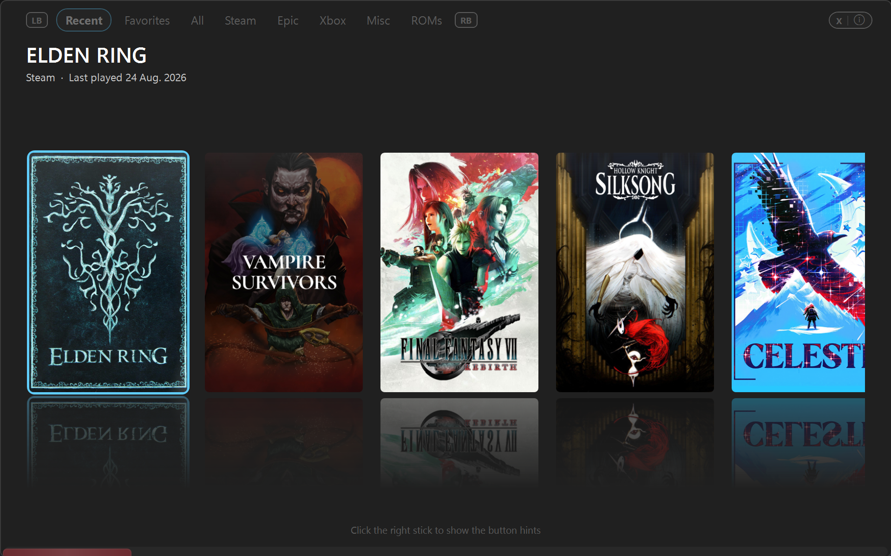
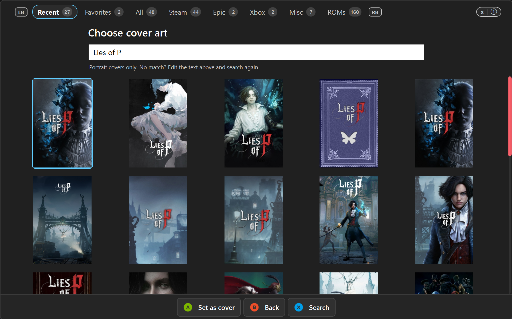
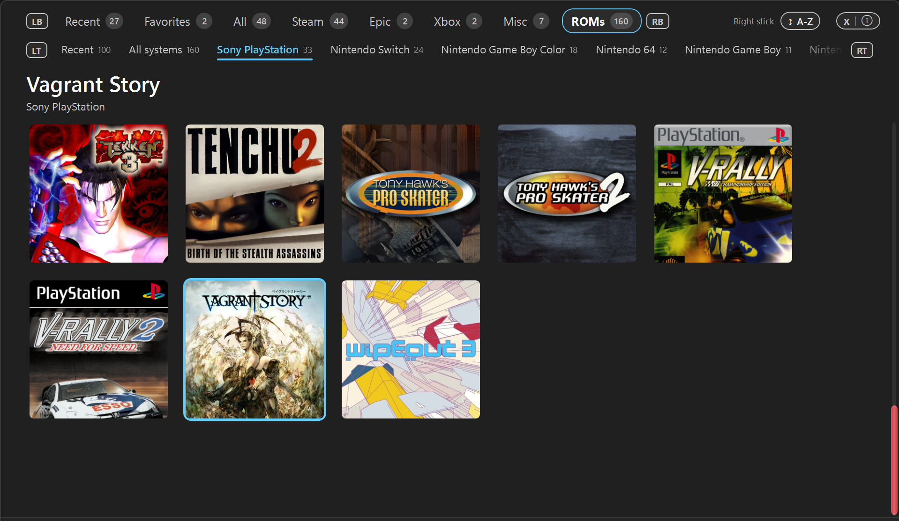
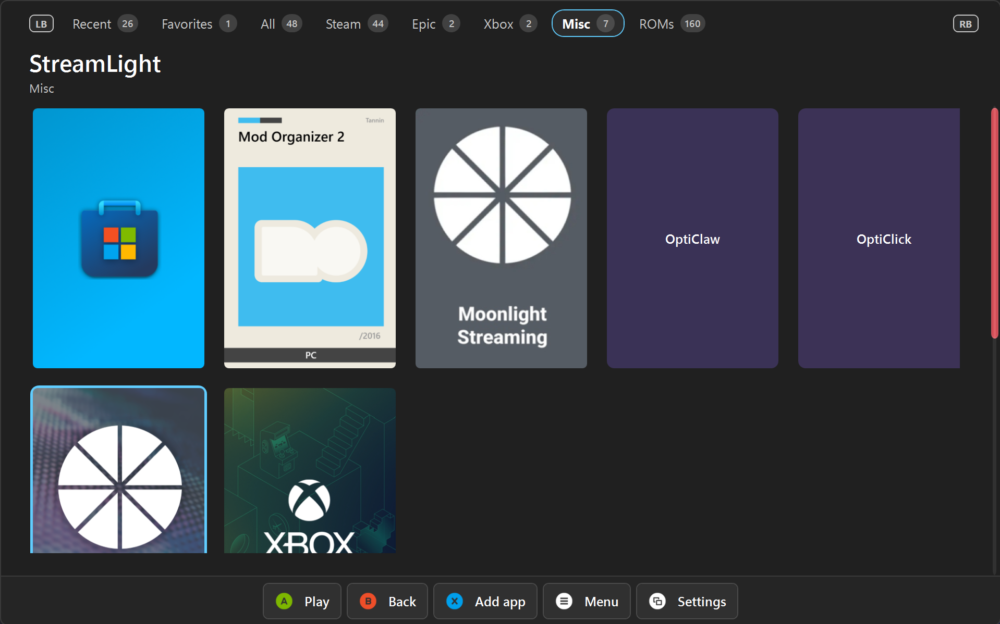

# ClawTweaks Center

Installer and control panel for [ClawTweaks](https://github.com/enterTheVoidCode/ClawTweaks) on the
MSI Claw. Center installs and updates the ClawTweaks app package, guides you through the
prerequisites it cannot install for you, and gives you a controller-navigable menu for maintenance
tasks once everything is in place.

Center is shipped as **one self-contained exe**: no .NET installation required, nothing to unpack.

**Download:** [latest release](https://github.com/enterTheVoidCode/ClawTweaksCenter/releases/latest).
Center updates itself from there.

## The game library

Steam, Epic, Xbox, Ubisoft, EA, Battle.net and GOG, your ROMs from Playnite and your own apps on one
shelf — made for the controller, with the cover art the stores already cached. Center can open
straight into it.

Games without cached art can be given a cover from SteamGridDB, and any cover can be swapped the
same way.

ROMs come in from Playnite with their systems, icons and emulator start parameters. Keep managing
them in Playnite.

Anything else you want to start from the same place goes under My Apps.

## Two things worth knowing

**Center never asks for administrator rights.** It installs itself per user, and the things that
genuinely need elevation are handed to their vendors' own installers or to the signed ClawTweaks
helper.

**Center does not download and run executables.** Installing the ClawTweaks **app package** goes
through Windows' own package installer.

## Source code

Center is closed source. This repository holds the releases, the screenshots above and the files
Center downloads at runtime (`update-manifest.json`, `wallpapers/`, `music/`) — please leave their
paths as they are, installed copies depend on them.

Bugs and ideas are welcome as [issues](https://github.com/enterTheVoidCode/ClawTweaksCenter/issues).
The Game Bar **widget** is public and lives in the main
[`ClawTweaks`](https://github.com/enterTheVoidCode/ClawTweaks) repository.

## License

All rights reserved — see [LICENSE](LICENSE). The released builds are free to use.
